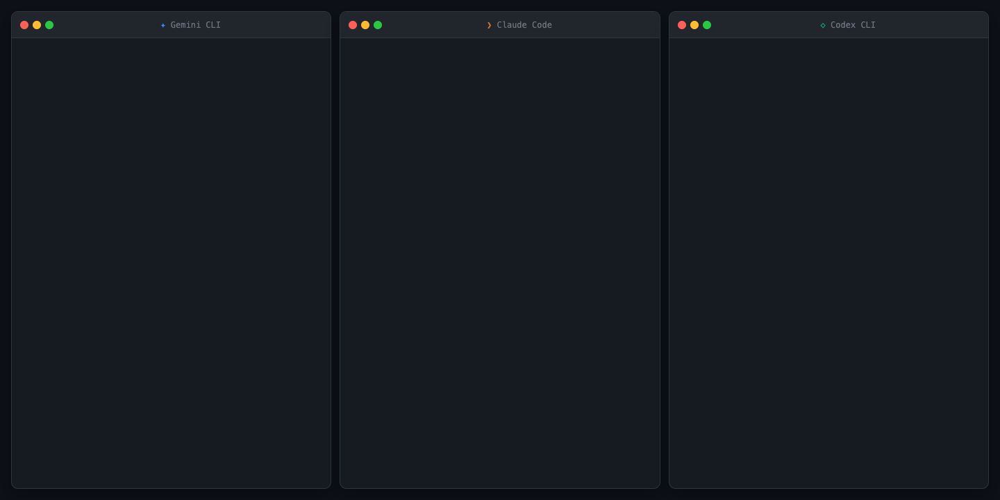
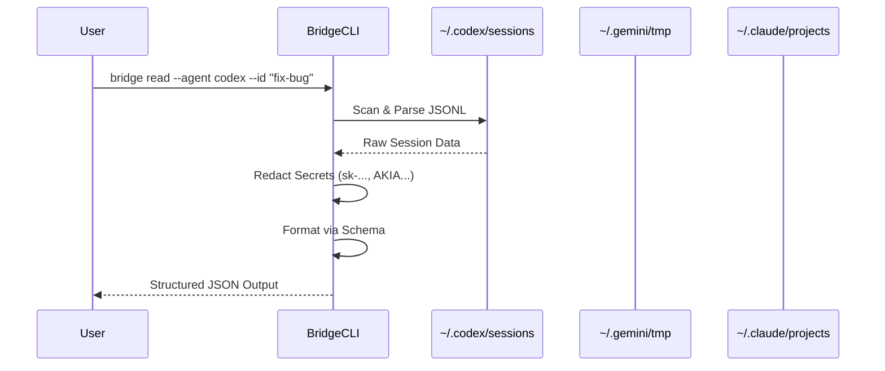

# Inter-Agent Bridge


**Inter-Agent Bridge** is a lightweight local protocol and reference implementation for reading cross-agent session context. It enables AI agents (Codex, Gemini, Claude) to "read" each other's conversation history from local storage, facilitating coordination, verification, and steering without a centralized cloud service.

## 🌟 Key Tenets

1.  **Local-First**: Reads directly from local session logs (`~/.codex/sessions`, etc.) by default. No data leaves your machine.
2.  **Evidence-Based**: Every claim or summary must track back to a specific source session file.
3.  **Privacy-Focused**: Automatically redacts sensitive keys (API keys, AWS tokens) before output.
4.  **Dual Parity**: Ships with both **Node.js** and **Rust** CLIs that guarantee the same output contract.

## � Demo



## �🏗️ Architecture

The bridge acts as a universal translator for agent session formats.



## 🚀 Feature Matrix

| Feature            | Codex | Gemini | Claude |
| :----------------- | :---: | :----: | :----: |
| **Read Content**   |  ✅   |   ✅   |   ✅   |
| **Auto-Discovery** |  ✅   |   ✅   |   ✅   |
| **CWD Scoping**    |  ✅   |   ❌   |   ✅   |
| **Comparisons**    |  ✅   |   ✅   |   ✅   |

## 📦 Installation

### Consumers (Users)

Install the CLI tool globally to use it from your terminal.

**Node.js**:

```bash
npm install -g inter-agent-bridge-cli
bridge-node read --agent=codex --json
```

**Rust (Recommended for Performance)**:

```bash
cargo install bridge-cli
bridge read --agent codex --json
```

### Contributors (Developers)

Clone the repository to build from source.

**Node**:

```bash
npm install
node scripts/read_session.cjs --agent=codex
```

**Rust**:

```bash
cargo run --manifest-path cli/Cargo.toml -- read --agent codex
```

## 📖 Usage

### Reading a Session

Get the last assistant message from a specific agent context.

```bash
# Read from Codex (defaults to latest session)
bridge read --agent codex

# Read from Claude, scoped to current working directory
bridge read --agent claude --cwd /path/to/project

# Get machine-readable JSON output
bridge read --agent gemini --json
```

### Comparing Agents (`analyze` mode)

Compare outputs from multiple agents to detect divergence.

```bash
bridge compare --source codex:latest --source gemini:latest --json
```

### Reporting

Generate a full coordination report from a handoff packet.

```bash
bridge report --handoff ./handoff_packet.json --json
```

## ⚙️ Configuration

Override default paths using environment variables.

| Variable                     | Description               | Default              |
| :--------------------------- | :------------------------ | :------------------- |
| `BRIDGE_CODEX_SESSIONS_DIR`  | Path to Codex sessions    | `~/.codex/sessions`  |
| `BRIDGE_GEMINI_TMP_DIR`      | Path to Gemini temp chats | `~/.gemini/tmp`      |
| `BRIDGE_CLAUDE_PROJECTS_DIR` | Path to Claude projects   | `~/.claude/projects` |

## 🛠️ Development

- **Protocol**: See [PROTOCOL.md](./PROTOCOL.md) for the CLI and JSON specification.
- **Skills**: See [SKILL.md](./SKILL.md) for agentic capabilities.
- **Release**: See [docs/release.md](./docs/release.md) for publishing workflows.

### Conformance Testing

Ensure both Node and Rust implementations return identical output for the same fixtures.

```bash
bash scripts/conformance.sh
```

### Schema Validation

Validate that generated reports match the JSON schema.

```bash
bash scripts/validate_schemas.sh
```

---

_Maintained by the Agent Bridge Team._
