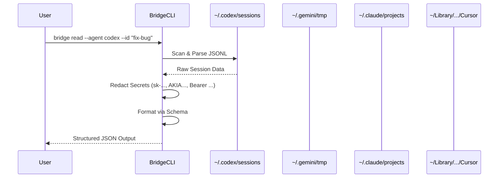

# Inter-Agent Bridge


**Inter-Agent Bridge** is a lightweight local protocol and reference implementation for reading cross-agent session context. It enables AI agents (Codex, Gemini, Claude, Cursor) to "read" each other's conversation history from local storage, facilitating coordination, verification, and steering without a centralized cloud service.

## Key Tenets

1. **Local-First**: Reads directly from local session logs (`~/.codex/sessions`, etc.) by default. No data leaves your machine.
2. **Evidence-Based**: Every claim or summary must track back to a specific source session file.
3. **Privacy-Focused**: Automatically redacts sensitive keys (API keys, AWS tokens, bearer tokens, passwords) before output.
4. **Dual Parity**: Ships with both **Node.js** and **Rust** CLIs that guarantee the same output contract.

## Demo


## Architecture

The bridge acts as a universal translator for agent session formats. Each agent has a dedicated **adapter** that handles session resolution, reading, and listing.



## Feature Matrix

| Feature            | Codex | Gemini | Claude | Cursor |
| :----------------- | :---: | :----: | :----: | :----: |
| **Read Content**   |  Yes  |  Yes   |  Yes   |  Yes   |
| **Auto-Discovery** |  Yes  |  Yes   |  Yes   |  Yes   |
| **CWD Scoping**    |  Yes  |   No   |  Yes   |   No   |
| **List Sessions**  |  Yes  |  Yes   |  Yes   |  Yes   |
| **Search**         |  Yes  |  Yes   |  Yes   |  Yes   |
| **Comparisons**    |  Yes  |  Yes   |  Yes   |  Yes   |

## Installation

### Consumers (Users)

Install the CLI tool globally to use it from your terminal.

**Node.js**:

```bash
npm install -g inter-agent-bridge-cli
bridge-node read --agent=codex --json
```

**Rust (Recommended for Performance)**:

```bash
cargo install bridge-cli
bridge read --agent codex --json
```

### Contributors (Developers)

Clone the repository to build from source.

**Node**:

```bash
npm install
node scripts/read_session.cjs read --agent=codex
```

**Rust**:

```bash
cargo run --manifest-path cli/Cargo.toml -- read --agent codex
```

## Usage

> **Note**: The examples below use the `bridge` command. If you installed via Node.js (`npm`), the binary is named `bridge-node`. You can either alias it (`alias bridge=bridge-node`) or substitute `bridge-node` in the commands.

### Reading a Session

Get assistant messages from a specific agent context.

```bash
# Read from Codex (defaults to latest session, last message)
bridge read --agent codex

# Read from Claude, scoped to current working directory
bridge read --agent claude --cwd /path/to/project

# Read the last 5 assistant messages from a session
bridge read --agent codex --id "fix-bug" --last 5

# Read from Cursor
bridge read --agent cursor --json

# Get machine-readable JSON output
bridge read --agent gemini --json
```

When `--last N` is greater than 1, multiple messages are separated by `\n---\n` in the `content` field.

**JSON output includes metadata:**

```json
{
  "agent": "codex",
  "source": "/path/to/session.jsonl",
  "content": "The assistant's response...",
  "warnings": [],
  "session_id": "session-abc123",
  "cwd": "/workspace/project",
  "timestamp": "2026-01-15T10:30:00Z",
  "message_count": 12,
  "messages_returned": 1
}
```

### Listing Sessions

List recent sessions for an agent.

```bash
# List the 10 most recent Codex sessions
bridge list --agent codex --json

# Limit results
bridge list --agent claude --limit 5 --json

# Scope to a working directory
bridge list --agent codex --cwd /path/to/project --json
```

**JSON output:**

```json
[
  {
    "session_id": "session-abc123",
    "agent": "codex",
    "cwd": "/workspace/project",
    "modified_at": "2026-01-15T10:30:00Z",
    "file_path": "/home/user/.codex/sessions/2026/01/15/session-abc123.jsonl"
  }
]
```

### Searching Sessions (Rust CLI)

Search session contents by keyword.

```bash
# Find sessions mentioning "authentication"
bridge search "authentication" --agent claude --json

# Limit results
bridge search "bug fix" --agent codex --limit 3 --json
```

### Comparing Agents (`analyze` mode)

Compare outputs from multiple agents to detect divergence.

```bash
# Compare latest sessions across agents
bridge compare --source codex --source gemini --source claude --json

# Compare specific sessions
bridge compare --source codex:fix-bug --source claude:fix-bug --json

# Ignore whitespace differences
bridge compare --source codex --source gemini --normalize --json
```

The `--normalize` flag collapses all whitespace before comparison, so formatting-only differences are ignored.

### Reporting

Generate a full coordination report from a handoff packet.

```bash
bridge report --handoff ./handoff_packet.json --json
```

### Error Handling

When `--json` is active, errors are returned as structured JSON with a stable error code:

```json
{
  "error_code": "NOT_FOUND",
  "message": "No Codex session found."
}
```

| Error Code          | Meaning                              |
| :------------------ | :----------------------------------- |
| `NOT_FOUND`         | No matching session found            |
| `PARSE_FAILED`      | Session file could not be parsed     |
| `INVALID_HANDOFF`   | Malformed handoff packet             |
| `UNSUPPORTED_AGENT` | Unknown agent type                   |
| `UNSUPPORTED_MODE`  | Invalid mode in handoff              |
| `EMPTY_SESSION`     | Session exists but has no messages   |
| `IO_ERROR`          | General I/O error                    |

## Configuration

Override default paths using environment variables.

| Variable                     | Description                 | Default                                |
| :--------------------------- | :-------------------------- | :------------------------------------- |
| `BRIDGE_CODEX_SESSIONS_DIR`  | Path to Codex sessions      | `~/.codex/sessions`                    |
| `BRIDGE_GEMINI_TMP_DIR`      | Path to Gemini temp chats   | `~/.gemini/tmp`                        |
| `BRIDGE_CLAUDE_PROJECTS_DIR` | Path to Claude projects     | `~/.claude/projects`                   |
| `BRIDGE_CURSOR_DATA_DIR`     | Path to Cursor data         | `~/Library/Application Support/Cursor` |

## Redaction

The bridge automatically redacts sensitive data before output:

| Pattern                     | Example Input           | Redacted Output        |
| :-------------------------- | :---------------------- | :--------------------- |
| OpenAI-style API keys       | `sk-abc123...`          | `sk-[REDACTED]`        |
| AWS access key IDs          | `AKIA1234567890ABCDEF`  | `AKIA[REDACTED]`       |
| Bearer tokens               | `Bearer eyJhbG...`      | `Bearer [REDACTED]`    |
| Secret assignments          | `api_key="super-secret"` | `api_key=[REDACTED]`  |

Redaction is applied to `api_key`, `apikey`, `token`, `secret`, and `password` assignments with `=` or `:` separators.

## Development

- **Protocol**: See [PROTOCOL.md](./PROTOCOL.md) for the CLI and JSON specification.
- **Skills**: See [SKILL.md](./SKILL.md) for agentic capabilities.
- **Release**: See [docs/release.md](./docs/release.md) for publishing workflows.

### Project Structure

```
scripts/
  read_session.cjs        # Node.js CLI implementation
  adapters/               # Node.js agent adapters
    codex.cjs
    gemini.cjs
    claude.cjs
    cursor.cjs
    registry.cjs
    utils.cjs
  conformance.sh          # Cross-implementation parity tests
  test_edge_cases.sh      # Edge-case and error code tests
  validate_schemas.sh     # JSON schema validation
  check_readme_examples.sh
  compare_read_output.cjs # Golden file comparison utility

cli/
  src/
    main.rs               # Rust CLI entry point
    agents.rs             # Session parsing, redaction, error codes
    report.rs             # Compare and report logic
    adapters/             # Rust agent adapters
      mod.rs              # AgentAdapter trait + registry
      codex.rs
      gemini.rs
      claude.rs
      cursor.rs

schemas/
  handoff.schema.json     # Handoff packet schema
  read-output.schema.json # Read command output schema
  list-output.schema.json # List command output schema
  error.schema.json       # Structured error output schema

fixtures/
  session-store/          # Test session files per agent
  golden/                 # Canonical expected outputs for conformance
```

### Testing

Run the full test suite:

```bash
# Install dependencies
npm install

# Cross-implementation conformance (Node vs Rust parity + golden file diffs)
bash scripts/conformance.sh

# Edge-case tests (malformed input, missing data, error codes)
bash scripts/test_edge_cases.sh

# JSON schema validation
bash scripts/validate_schemas.sh

# Rust unit tests (redaction, parsing)
cargo test --manifest-path cli/Cargo.toml

# README command verification
bash scripts/check_readme_examples.sh
```

### Adding a New Agent

Both implementations use an adapter pattern. To add a new agent:

1. **Rust**: Create `cli/src/adapters/<agent>.rs` implementing the `AgentAdapter` trait, register it in `cli/src/adapters/mod.rs`
2. **Node**: Create `scripts/adapters/<agent>.cjs` exporting `resolve`, `read`, and `list`, register it in `scripts/adapters/registry.cjs`
3. Add the agent name to enums in `schemas/*.schema.json`
4. Add test fixtures in `fixtures/session-store/<agent>/` and golden files in `fixtures/golden/`
5. Add conformance and edge-case tests

---

_Maintained by Amit._
