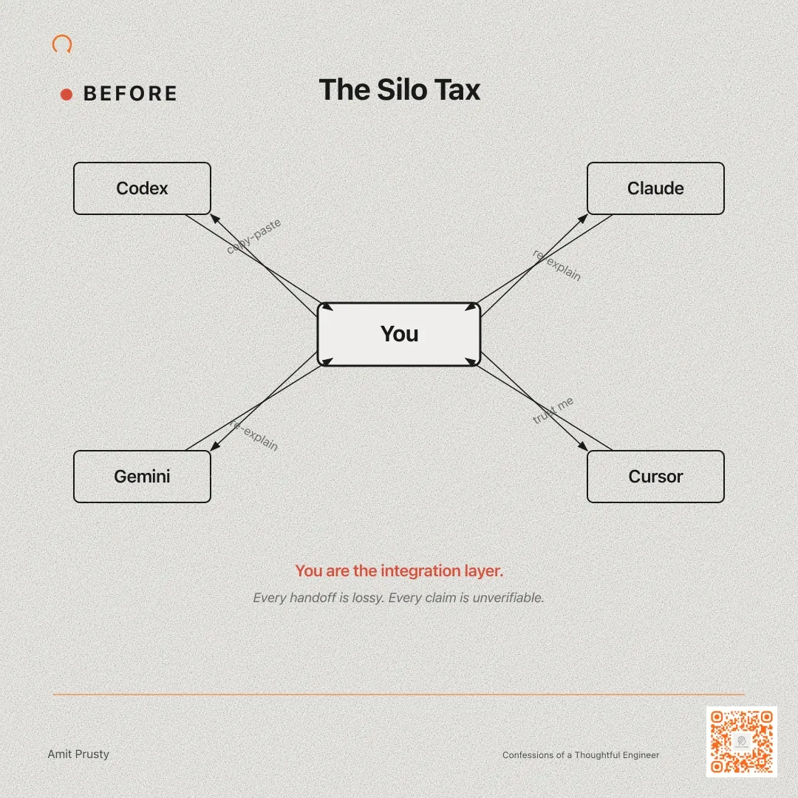
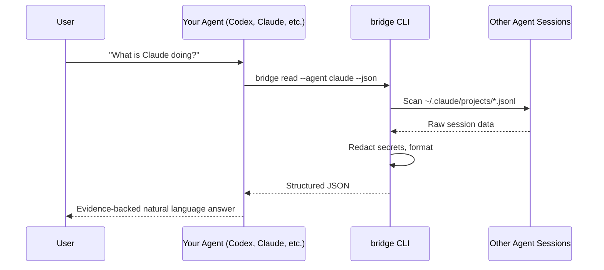
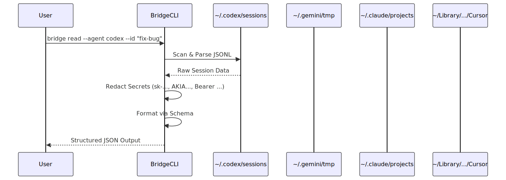

# Agent Bridge


**Let your AI agents talk about each other.**

Ask one agent what another is doing - and get an evidence-backed answer. No copy-pasting, no tab-switching, no guessing.

```bash
bridge read --agent claude --json
```

## How It Works

1. **Ask naturally** - "What is Claude doing?" / "Did Gemini finish the API?"
2. **Agent runs bridge** - Your agent calls `bridge read`, `bridge compare`, etc. behind the scenes.
3. **Evidence-backed answer** - Sources cited, divergences flagged, no hallucination.

**Tenets:**
- **Local-first** - reads directly from agent session logs on your machine. No data leaves.
- **Evidence-based** - every claim tracks to a specific source session file.
- **Privacy-focused** - automatically redacts API keys, tokens, and passwords.
- **Dual parity** - ships Node.js + Rust CLIs with identical output contracts.

## Demo

### The Status Check

Three agents working on checkout. You ask Codex what the others are doing.


<details><summary>More Demos</summary>

### The Handoff

Switch from Gemini to Claude mid-task. Claude picks up where Gemini left off.


### Quick Setup

From zero to a working skill query in under a minute.


</details>

## Quick Start

### 1. Install

```bash
npm install -g agent-bridge
# or
cargo install agent-bridge
```

### 2. Setup

```bash
bridge setup
bridge doctor
```

This wires skill triggers into your agent configs (`CLAUDE.md`, `GEMINI.md`, `AGENTS.md`) so agents know how to use the bridge.

### 3. Ask

Tell any agent:

> "What is Claude doing?"
> "Compare Codex and Gemini outputs."
> "Pick up where Gemini left off."

The agent runs bridge commands behind the scenes and gives you an evidence-backed answer.

### Session Selection Defaults

After `bridge setup`, provider instructions follow this behavior:

- If no session is specified, read the latest session in the current project.
- "past session" / "previous session" means one session before latest.
- "last N sessions" includes latest.
- "past N sessions" excludes latest (older N sessions).
- Ask for a session ID only if initial fetch fails or exact ID is explicitly requested.

## Context Pack

A context pack is an agent-first, token-efficient repo briefing for end-to-end understanding tasks.
Instead of re-reading the full repository on every request, agents start from `.agent-context/current/` and open source files only when needed.

### Recommended Workflow

```bash
# One-shot setup (recommended for new installs)
bridge setup --context-pack

# Manual build/refresh
bridge context-pack build

# Install pre-push hook (syncs only for main pushes when relevant)
bridge context-pack install-hooks
```

Ask your agent explicitly:

> "Understand this repo end-to-end using the context pack first, then deep dive only where needed."

### Context Pack Demo

Create and wire a context pack for token-efficient repo understanding:


### Main Push Sync Policy

- Pushes that do not target `main`: skipped.
- Pushes to `main` with no context-relevant changes: skipped.
- Pushes to `main` with context-relevant changes: rebuilds pack and creates local recovery snapshot.

Optional pre-PR guard:

```bash
bridge context-pack check-freshness --base origin/main
```

### Usage Boundaries

- Do not treat context pack as a substitute for source-of-truth when changing behavior-critical code.
- Do not expect automatic updates from commits alone or non-`main` branch pushes.
- Do not put secrets in context-pack content; `.agent-context/current/` is tracked in git.

Recovery matrix:

- `.agent-context/current/` -> `git checkout <commit> -- .agent-context/current`
- `.agent-context/snapshots/` -> `bridge context-pack rollback`

## Supported Agents

| Feature            | Codex | Gemini | Claude | Cursor |
| :----------------- | :---: | :----: | :----: | :----: |
| **Read Content**   |  Yes  |  Yes   |  Yes   |  Yes   |
| **Auto-Discovery** |  Yes  |  Yes   |  Yes   |  Yes   |
| **CWD Scoping**    |  Yes  |   No   |  Yes   |   No   |
| **List Sessions**  |  Yes  |  Yes   |  Yes   |  Yes   |
| **Search**         |  Yes  |  Yes   |  Yes   |  Yes   |
| **Comparisons**    |  Yes  |  Yes   |  Yes   |  Yes   |

## Architecture

The bridge sits between your agent and other agents' session logs. You talk to your agent - your agent talks to the bridge.





<details><summary>Diagram not rendering? View as image</summary>



</details>

## Easter Egg

`bridge trash-talk` roasts your agents based on their session content.


## Choose Your Path

- **I need full command syntax and JSON outputs**: [`docs/CLI_REFERENCE.md`](./docs/CLI_REFERENCE.md)
- **I need context-pack internals and policy details**: [`CONTEXT_PACK.md`](./CONTEXT_PACK.md)
- **I am contributing or extending the codebase**: [`docs/DEVELOPMENT.md`](./docs/DEVELOPMENT.md)
- **I need protocol and schema contract details**: [`PROTOCOL.md`](./PROTOCOL.md)
- **I need contribution process and PR expectations**: [`CONTRIBUTING.md`](./CONTRIBUTING.md)
- **I need release-level changes and upgrade notes**: [`RELEASE_NOTES.md`](./RELEASE_NOTES.md)

---

Contributions and issue reports are welcome.
