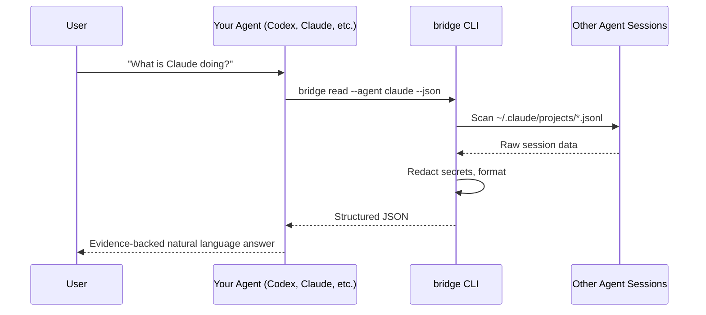

# Agent Bridge


**Let your AI agents talk about each other.**

Ask one agent what another is doing — and get an evidence-backed answer. No copy-pasting, no tab-switching, no guessing.

```bash
bridge read --agent claude --json
```

## How It Works

1. **Ask naturally** — "What is Claude doing?" / "Did Gemini finish the API?"
2. **Agent runs bridge** — Your agent calls `bridge read`, `bridge compare`, etc. behind the scenes
3. **Evidence-backed answer** — Sources cited, divergences flagged, no hallucination

**Tenets:**
- **Local-first** — reads directly from agent session logs on your machine. No data leaves.
- **Evidence-based** — every claim tracks to a specific source session file.
- **Privacy-focused** — automatically redacts API keys, tokens, and passwords.
- **Dual parity** — ships Node.js + Rust CLIs with identical output contracts.

## Demo

### The Status Check

Three agents working on checkout. You ask Codex what the others are doing.


<details><summary>More Demos</summary>

### The Handoff

Switch from Gemini to Claude mid-task. Claude picks up where Gemini left off.


### Quick Setup

From zero to a working skill query in under a minute.


</details>

## Quick Start

### 1. Install

```bash
npm install -g agent-bridge
# or
cargo install agent-bridge
```

### 2. Setup

```bash
bridge setup
bridge doctor
```

This wires skill triggers into your agent configs (`CLAUDE.md`, `GEMINI.md`, `AGENTS.md`) so agents know how to use the bridge.

### 3. Ask

Tell any agent:

> "What is Claude doing?"
> "Compare Codex and Gemini outputs."
> "Pick up where Gemini left off."

The agent runs bridge commands behind the scenes and gives you an evidence-backed answer.

### Session Selection Defaults

After `bridge setup`, provider instructions follow this behavior:

- If no session is specified, read the latest session in the current project.
- "past session" / "previous session" means one session before latest.
- "last N sessions" includes latest.
- "past N sessions" excludes latest (older N sessions).
- Ask for a session ID only if initial fetch fails or exact ID is explicitly requested.

## Supported Agents

| Feature            | Codex | Gemini | Claude | Cursor |
| :----------------- | :---: | :----: | :----: | :----: |
| **Read Content**   |  Yes  |  Yes   |  Yes   |  Yes   |
| **Auto-Discovery** |  Yes  |  Yes   |  Yes   |  Yes   |
| **CWD Scoping**    |  Yes  |   No   |  Yes   |   No   |
| **List Sessions**  |  Yes  |  Yes   |  Yes   |  Yes   |
| **Search**         |  Yes  |  Yes   |  Yes   |  Yes   |
| **Comparisons**    |  Yes  |  Yes   |  Yes   |  Yes   |

## Architecture

The bridge sits between your agent and other agents' session logs. You talk to your agent — your agent talks to the bridge.



<details><summary>Diagram not rendering? View as image</summary>


</details>

<details><summary><h2>CLI Reference</h2></summary>

### Command Contract

```bash
bridge read --agent <codex|gemini|claude|cursor> [--id=<substring>] [--cwd=<path>] [--chats-dir=<path>] [--last=<N>] [--json]
bridge compare --source <agent[:session-substring]>... [--cwd=<path>] [--normalize] [--json]
bridge report --handoff <handoff.json> [--cwd=<path>] [--json]
bridge list --agent <codex|gemini|claude|cursor> [--cwd=<path>] [--limit=<N>] [--json]
bridge search <query> --agent <codex|gemini|claude|cursor> [--cwd=<path>] [--limit=<N>] [--json]
bridge setup [--cwd=<path>] [--dry-run] [--force] [--json]
bridge doctor [--cwd=<path>] [--json]
```

### Reading a Session

```bash
# Read from Codex (defaults to latest session, last message)
bridge read --agent codex

# Read from Claude, scoped to current working directory
bridge read --agent claude --cwd /path/to/project

# Read the previous (past) Claude session
bridge list --agent claude --cwd /path/to/project --limit 2 --json
bridge read --agent claude --id "<second-session-id>" --cwd /path/to/project

# Read the last 5 assistant messages from a session
bridge read --agent codex --id "fix-bug" --last 5

# Read from Cursor
bridge read --agent cursor --json

# Get machine-readable JSON output
bridge read --agent gemini --json
```

When `--last N` is greater than 1, multiple messages are separated by `\n---\n` in the `content` field.

**JSON output includes metadata:**

```json
{
  "agent": "codex",
  "source": "/path/to/session.jsonl",
  "content": "The assistant's response...",
  "warnings": [],
  "session_id": "session-abc123",
  "cwd": "/workspace/project",
  "timestamp": "2026-01-15T10:30:00Z",
  "message_count": 12,
  "messages_returned": 1
}
```

### Listing Sessions

```bash
# List the 10 most recent Codex sessions
bridge list --agent codex --json

# Limit results
bridge list --agent claude --limit 5 --json

# Scope to a working directory
bridge list --agent codex --cwd /path/to/project --json
```

**JSON output:**

```json
[
  {
    "session_id": "session-abc123",
    "agent": "codex",
    "cwd": "/workspace/project",
    "modified_at": "2026-01-15T10:30:00Z",
    "file_path": "/home/user/.codex/sessions/2026/01/15/session-abc123.jsonl"
  }
]
```

### Searching Sessions

```bash
# Find sessions mentioning "authentication"
bridge search "authentication" --agent claude --json

# Limit results
bridge search "bug fix" --agent codex --limit 3 --json
```

### Comparing Agents

```bash
# Compare latest sessions across agents
bridge compare --source codex --source gemini --source claude --json

# Compare specific sessions
bridge compare --source codex:fix-bug --source claude:fix-bug --json

# Ignore whitespace differences
bridge compare --source codex --source gemini --normalize --json
```

The `--normalize` flag collapses all whitespace before comparison.

### Reporting

```bash
bridge report --handoff ./handoff_packet.json --json
```

### Error Codes

When `--json` is active, errors are returned as structured JSON:

```json
{
  "error_code": "NOT_FOUND",
  "message": "No Codex session found."
}
```

| Error Code          | Meaning                              |
| :------------------ | :----------------------------------- |
| `NOT_FOUND`         | No matching session found            |
| `PARSE_FAILED`      | Session file could not be parsed     |
| `INVALID_HANDOFF`   | Malformed handoff packet             |
| `UNSUPPORTED_AGENT` | Unknown agent type                   |
| `UNSUPPORTED_MODE`  | Invalid mode in handoff              |
| `EMPTY_SESSION`     | Session exists but has no messages   |
| `IO_ERROR`          | General I/O error                    |

### Configuration

Override default paths using environment variables.

| Variable                     | Description                 | Default                                |
| :--------------------------- | :-------------------------- | :------------------------------------- |
| `BRIDGE_CODEX_SESSIONS_DIR`  | Path to Codex sessions      | `~/.codex/sessions`                    |
| `BRIDGE_GEMINI_TMP_DIR`      | Path to Gemini temp chats   | `~/.gemini/tmp`                        |
| `BRIDGE_CLAUDE_PROJECTS_DIR` | Path to Claude projects     | `~/.claude/projects`                   |
| `BRIDGE_CURSOR_DATA_DIR`     | Path to Cursor data         | `~/Library/Application Support/Cursor` |

### Redaction

The bridge automatically redacts sensitive data before output:

| Pattern                     | Example Input           | Redacted Output        |
| :-------------------------- | :---------------------- | :--------------------- |
| OpenAI-style API keys       | `sk-abc123...`          | `sk-[REDACTED]`        |
| AWS access key IDs          | `AKIA1234567890ABCDEF`  | `AKIA[REDACTED]`       |
| Bearer tokens               | `Bearer eyJhbG...`      | `Bearer [REDACTED]`    |
| Secret assignments          | `api_key="super-secret"` | `api_key=[REDACTED]`  |

Redaction is applied to `api_key`, `apikey`, `token`, `secret`, and `password` assignments with `=` or `:` separators.

</details>

## Development

- **Protocol**: See [`PROTOCOL.md`](https://github.com/cote-star/agent-bridge/blob/main/PROTOCOL.md) for the CLI and JSON specification.
- **Skill**: See [`SKILL.md`](https://github.com/cote-star/agent-bridge/blob/main/SKILL.md) for cross-agent trigger behavior and evidence workflow.
- **Contributing**: See [`CONTRIBUTING.md`](https://github.com/cote-star/agent-bridge/blob/main/CONTRIBUTING.md) for setup, tests, and PR expectations.

### Project Structure

```
scripts/
  read_session.cjs        # Node.js CLI implementation
  adapters/               # Node.js agent adapters
    codex.cjs
    gemini.cjs
    claude.cjs
    cursor.cjs
    registry.cjs
    utils.cjs
  conformance.sh          # Cross-implementation parity tests
  test_edge_cases.sh      # Edge-case and error code tests
  validate_schemas.sh     # JSON schema validation
  check_readme_examples.sh

cli/
  src/
    main.rs               # Rust CLI entry point
    agents.rs             # Session parsing, redaction, error codes
    report.rs             # Compare and report logic
    adapters/             # Rust agent adapters
      mod.rs              # AgentAdapter trait + registry
      codex.rs
      gemini.rs
      claude.rs
      cursor.rs

schemas/
  handoff.schema.json     # Handoff packet schema
  read-output.schema.json # Read command output schema
  list-output.schema.json # List command output schema
  error.schema.json       # Structured error output schema

fixtures/
  session-store/          # Test session files per agent
  golden/                 # Canonical expected outputs for conformance
```

### Testing

```bash
npm ci

# Cross-implementation conformance (Node vs Rust parity)
bash scripts/conformance.sh

# Edge-case tests
bash scripts/test_edge_cases.sh

# JSON schema validation
bash scripts/validate_schemas.sh

# Rust unit tests
cargo test --manifest-path cli/Cargo.toml

# README command verification
bash scripts/check_readme_examples.sh
```

### Regenerating Demo Assets

Requires `puppeteer` and `img2webp` (`brew install webp`):

```bash
npm install --save-dev puppeteer
node scripts/record_demo.js --input fixtures/demo/player-status.html --output docs/demo-status.webp --duration-ms 22000
node scripts/record_demo.js --input fixtures/demo/player-handoff.html --output docs/demo-handoff.webp --duration-ms 20000
node scripts/record_demo.js --input fixtures/demo/player-setup.html --output docs/demo-setup.webp --duration-ms 15000
node scripts/record_demo.js --input fixtures/demo/player-trash-talk.html --output docs/demo-trash-talk.webp --duration-ms 15000
npm uninstall puppeteer
```

### Easter Egg

`bridge trash-talk` roasts your agents based on their session content. Try it.


### Adding a New Agent

1. **Rust**: Create `cli/src/adapters/<agent>.rs` implementing `AgentAdapter`, register in `mod.rs`
2. **Node**: Create `scripts/adapters/<agent>.cjs` exporting `resolve`, `read`, `list`, register in `registry.cjs`
3. Add agent name to enums in `schemas/*.schema.json`
4. Add fixtures in `fixtures/session-store/<agent>/` and golden files in `fixtures/golden/`
5. Add conformance and edge-case tests

---

Contributions and issue reports are welcome.
